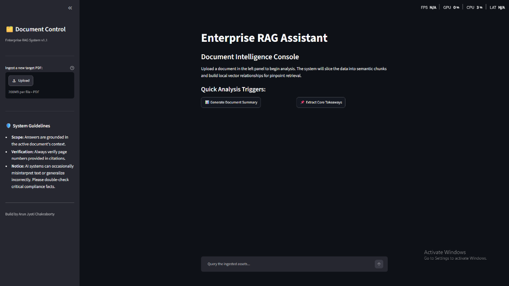
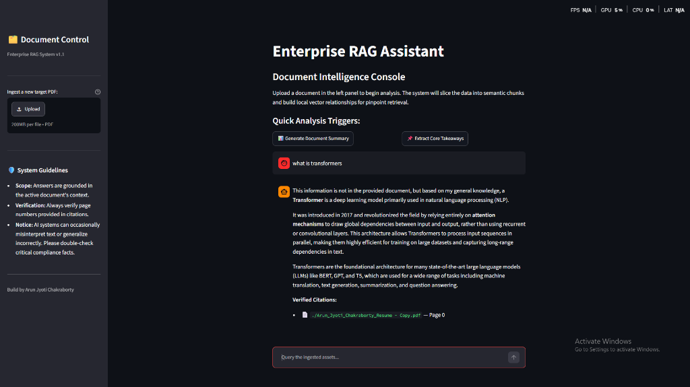
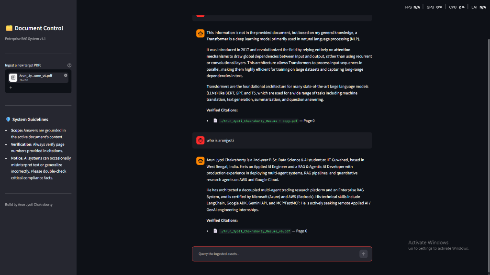

# Enterprise Document RAG System 🚀

An end-to-end, enterprise-grade **Retrieval-Augmented Generation (RAG)** assistant built to ingest, index, and query complex PDF documents with pinpoint accuracy. The system features a fully decoupled microservices architecture utilizing a FastAPI backend and a Streamlit frontend console. 

Powered by **Google Gemini** for embeddings and synthesis, the system guarantees context-grounded response generation with auto-extracted source-and-page citations to completely eliminate AI hallucinations.

---

## 🖥️ System Interface

### 1. Document Intelligence Console (Welcome Screen)


### 2. Contextual AI Answering


### 3. In-Line Verified Citations


---

## 🛠️ Architecture & Separation of Concerns

The project is structured as a decoupled microservices application, making it easy to deploy, scale, and maintain:

```plaintext
Enterprise-RAG-System/
├── backend/
│   ├── api.py           # FastAPI REST API server
│   ├── requirements.txt # Backend dependencies (FastAPI, LangChain, FAISS)
│   └── Dockerfile       # Container definition for the backend
├── frontend/
│   ├── app.py           # Streamlit user interface
│   ├── requirements.txt # Frontend dependencies (Streamlit, requests)
│   └── Dockerfile       # Container definition for the frontend
├── scripts/
│   ├── ingest.py        # CLI script to test document ingestion locally
│   └── query.py         # CLI script to test vector store querying locally
├── docs/
│   ├── image_615b79.png # UI Welcome Screen screenshot
│   ├── image_615bd1.png # AI Answering screenshot
│   └── image_615f15.png # Resume Retrieval screenshot
├── .env.example         # Template for environment variables
├── .gitignore           # Git ignore rule files
└── README.md            # Master documentation
```

### Key Subsystems:
* **FastAPI Backend (`backend/api.py`):** Exposes endpoints to upload PDFs and query the active document memory. Handles the LangChain pipelines, FAISS indexing, and Gemini integration.
* **Streamlit Frontend (`frontend/app.py`):** Delivers a rich, dark-mode dashboard for file upload, quick summaries, extraction of key takeaways, and chat console.
* **CLI Testing Tools (`scripts/`):** Independent test run scripts to verify vector embedding generation (`ingest.py`) and retrieval mechanics (`query.py`) from terminal.

---

## ⚡ RAG Pipeline Specs & Hyperparameters

To ensure precise information retrieval and high-quality synthesis, the ingestion and generation pipeline is tuned with the following details:
1. **Document Loading:** Documents are processed dynamically using LangChain's `PyPDFLoader` to preserve page metadata.
2. **Text Chunking:** Pages are split into overlapping fragments using `RecursiveCharacterTextSplitter` with:
   * **Chunk Size:** `2500` characters.
   * **Chunk Overlap:** `250` characters (to maintain context flow across boundaries).
3. **Semantic Embeddings:** Text chunks are transformed into 768-dimensional dense vectors using **`models/gemini-embedding-001`**.
4. **Vector Database:** Local **FAISS index** handles high-speed similarity search using cosine distance.
5. **Retrieval Metric:** **`k = 2`** (retrieves the top 2 most relevant source chunks for prompting).
6. **LLM Synthesis:** **`gemini-2.5-flash`** synthesizes answers grounded strictly in retrieved context.
7. **Hallucination Prevention:** A custom LangChain combining-documents chain enforces source grounding and returns verified source document names and page numbers on every single response.

---

## 🚀 Setup & Execution Guide

### Prerequisite: API Key Setup
Create a `.env` file in the root directory (based on `.env.example`) and add your Google Gemini API key:
```env
GOOGLE_API_KEY=AIzaSy...
```

### Running Locally (Bare Metal)

#### 1. Launch the Backend API
Navigate to the `backend/` folder, install requirements, and start the Uvicorn server:
```bash
cd backend
pip install -r requirements.txt
python api.py
```
*The backend API will start running at `http://127.0.0.1:8000`.*

#### 2. Launch the Streamlit Frontend
Navigate to the `frontend/` folder in a new terminal, install requirements, and run the Streamlit server:
```bash
cd frontend
pip install -r requirements.txt
streamlit run app.py
```
*The frontend dashboard will open in your default browser at `http://localhost:8501`.*

---

### Running via Docker Compose

Both microservices are containerized. You can run them in isolation or orchestra them using docker-compose.

#### Build and Run Backend:
```bash
cd backend
docker build -t rag-backend .
docker run -p 8000:8000 --env-file ../.env rag-backend
```

#### Build and Run Frontend:
```bash
cd frontend
docker build -t rag-frontend .
docker run -p 8501:8501 rag-frontend
```

---

## 🧑‍💻 CLI Sandbox Scripts

If you want to test indexing and querying without spawning the FastAPI server or UI console, run the script tools directly:

1. **Ingest a document:**
   Place a document named `sample.pdf` at the root folder and run:
   ```bash
   cd scripts
   python ingest.py
   ```
   *This generates/updates the vector index folder at `backend/faiss_index/`.*

2. **Query the document:**
   ```bash
   cd scripts
   python query.py
   ```
   *This fires a similarity search query against the index and outputs the Gemini synthesized answer and source citations.*
